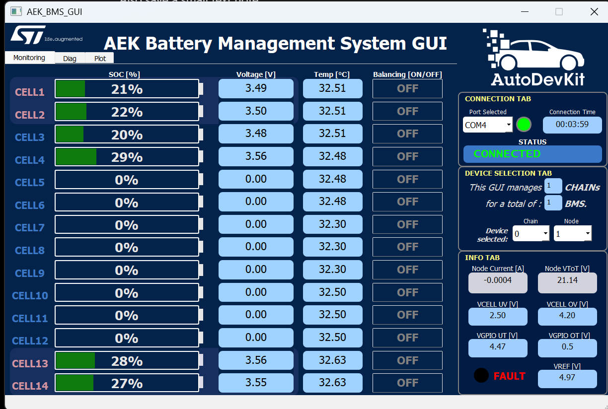
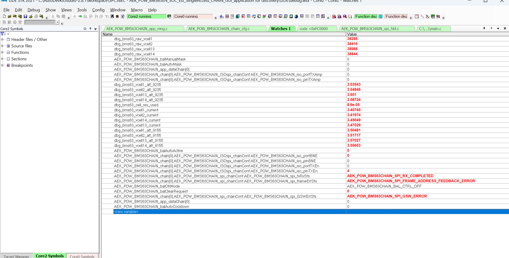

# Safe Testing Protocol

This protocol is intended for bench validation of the experimental six-cell configuration. It assumes the board and firmware have already been reviewed against the official ST documentation.

## Required Equipment

- DMM with sharp probes or safe probe clips;
- current-limited bench supply if applicable to your setup;
- UDE Starterkit 2021 debug connection;
- serial terminal;
- insulated tools and a clear bench;
- temperature observation method for long tests.

## Phase 1: Power-Off Inspection

1. Confirm only CELL1, CELL2, CELL3, CELL4, CELL13, and CELL14 are installed.
2. Inspect all bridge/short wiring for solder debris, loose strands, and accidental shorts.
3. Confirm connector orientation and pinout.
4. Verify the unused-channel bridge area against the schematic and official ST documentation.
5. Measure continuity across intended unused bridges.
6. Confirm no unintended continuity between adjacent active cell nodes.

Do not continue if any connection is uncertain.

## Phase 2: DMM Voltage Checks

With the BMS disconnected where practical:

| Measurement | Expected |
| --- | --- |
| CELL1 voltage | Realistic single-cell voltage |
| CELL2 voltage | Realistic single-cell voltage |
| CELL3 voltage | Realistic single-cell voltage |
| CELL4 voltage | Realistic single-cell voltage |
| CELL13 voltage | Realistic single-cell voltage |
| CELL14 voltage | Realistic single-cell voltage |
| CELL5-CELL12 bridge voltages | Near 0 V across each intended bridge |
| Pack voltage | Sum of the six physical cells |

For the validated test, active cells were around 3.44-3.52 V and pack voltage was around 20.8-21.0 V.

## Phase 3: First Firmware Boot

Start with the serial stream off and balancing off:

```text
S0
BAL OFF
```

Run diagnostics:

```text
TRIM?
FAULT?
BAL SAFETY?
BAL TEST?
BAL PHASE?
BAL SUMMARY?
```

Good expected patterns:

- trim/calibration OK;
- EEPROM/RAM CRC flags clear;
- VREF around expected range, observed about 4.97 V;
- SPI/BMS status healthy in the compact test report;
- current near zero;
- active cell voltages realistic;
- applied balancing mask is zero.

## Phase 4: Reset Energy Counters

```text
BAL ENERGY RESET
BAL ENERGY?
```

Confirm active cells are present and counters are zero.

## Phase 5: Manual Single-Cell Test

Choose one active high cell, for example CELL4:

```text
BAL CELL 4 ON
BAL?
AUTO?
BAL ENERGY?
BAL CELL 4 OFF
BAL?
```

Confirm:

- applied mask is only CELL4 (`0x0008`);
- CELL5-CELL12 remain off;
- energy counter increases only while ON;
- board temperature remains acceptable;
- DMM/firmware readings remain plausible.

If the GUI is connected, the monitoring page should show voltage only on the six physical cells. In the captured bench view, CELL1-CELL4 and CELL13-CELL14 show about 3.48-3.56 V, while CELL5-CELL12 show 0.00 V and balancing OFF.



Try a blocked cell intentionally:

```text
BAL CELL 5 ON
```

Expected:

```text
ERR;BAL;CELL_NOT_ALLOWED;
```

## Phase 6: AUTO Short Test

```text
BAL ENERGY RESET
BAL AUTO
AUTO?
BAL TEST?
BAL PHASE?
BAL SUMMARY?
```

Enable stream if useful:

```text
S1
```

Observe for one or two ON/OFF pulses only. Confirm:

- state transitions are understandable;
- selected cell is one of CELL1, CELL2, CELL3, CELL4, CELL13, CELL14;
- applied mask never includes CELL5-CELL12;
- current remains near zero;
- energy accounting rises at about the expected 90 mA ON-current rate.

Stop:

```text
S0
BAL OFF
BAL ENERGY?
```

## Phase 7: Longer Characterization Test

Only after the short test is clean:

1. Reset energy counters.
2. Start AUTO in `FAIR_SINGLE`.
3. Log `AUTO?`, `BAL?`, `BAL TEST?`, `BAL PHASE?`, `BAL SUMMARY?`, and `BAL ENERGY?`.
4. Record DMM spot checks.
5. Check resistor/board temperature periodically.
6. Stop after a planned duration.

Recommended start:

```text
BAL STRATEGY SINGLE
BAL ENERGY RESET
BAL AUTO
```

Do not start with `MULTI2`.

## Phase 8: Experimental MULTI2 Test

Only after single-cell mode has been validated:

```text
BAL STRATEGY MULTI2
BAL AUTO
```

Extra checks:

- selected cells are non-adjacent if that is part of the local constraint;
- estimated total balancing power stays below the configured cap;
- thermal rise is acceptable;
- no unused bits are present in the actual mask;
- energy accounting increments for only the applied cells.

Return to default:

```text
BAL STRATEGY SINGLE
BAL OFF
```

## Stop Conditions

Stop immediately with `BAL OFF` if:

- VREF is invalid;
- SPI/BMS communication state is invalid or stale;
- any active cell reads impossible voltage;
- any unused cell is requested or active;
- pack current is not near zero during AUTO balancing;
- chip temperature or board temperature is concerning;
- trim, CRC, or ground/reference flags become active;
- serial output and UDE watch variables disagree.

Reference UDE watch example:



## Test Record Template

```text
Date:
Board revision:
Firmware commit:
Cell type/capacity:
Cell voltages by DMM:
Firmware active-cell voltages:
Pack voltage:
VREF:
Pack current:
Fault report:
Trim report:
Strategy:
Start time:
Stop time:
Energy report:
Notes:
```
