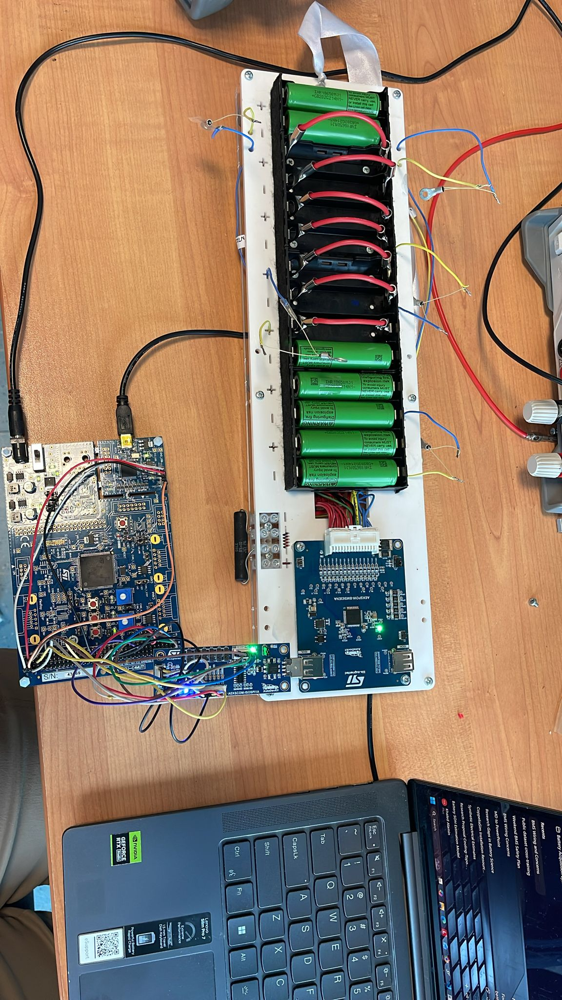
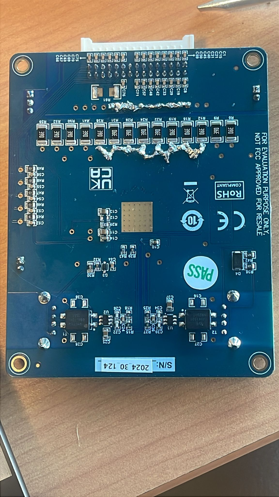
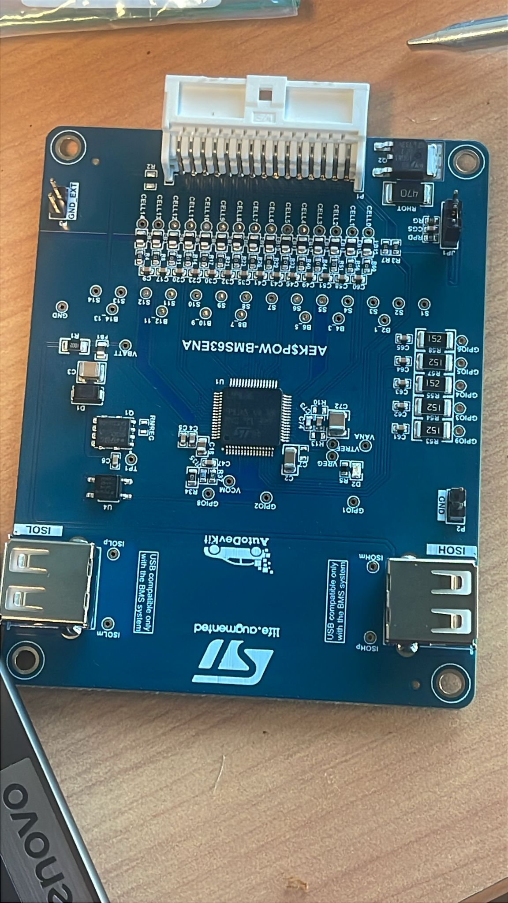
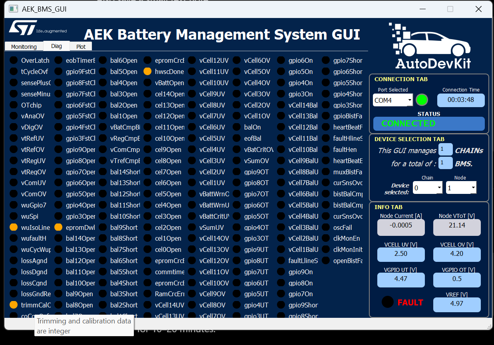
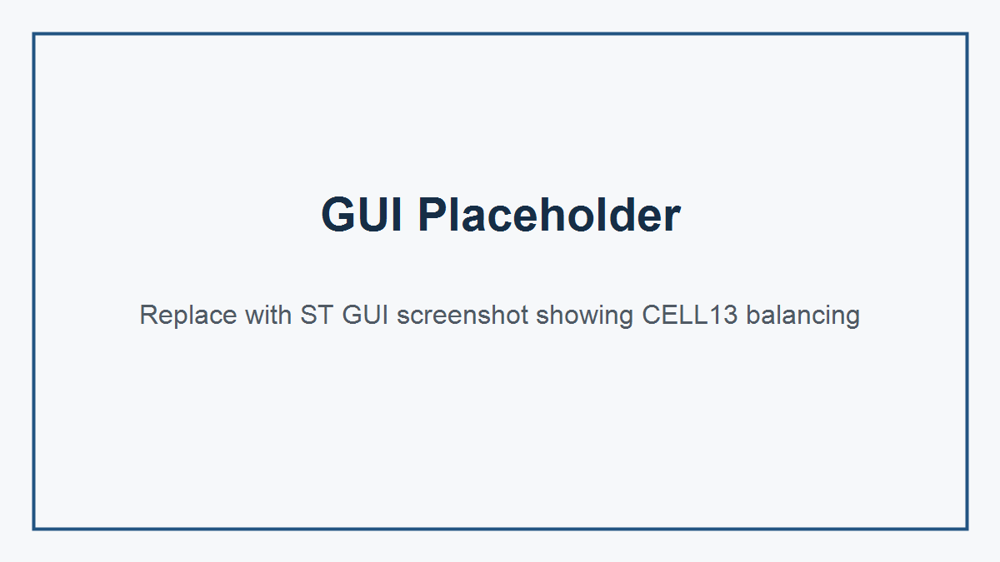

# 6-Cell Wiring on a 14-Channel Holder/Board

This document describes the experimental wiring concept used with the ST AEK-POW-BMS63EN / L9963E board when only six physical cells are installed in a 14-channel holder/board setup.

This is not a substitute for the official ST board documentation, L9963E datasheet, or schematic. Verify every connection before applying power.

## Physical Configuration

The holder/board path is treated as a 14-channel chain, but only these physical cells are installed:

| Physical cell | Used | Firmware bit | Hex bit |
| --- | --- | ---: | ---: |
| CELL1 | Yes | 0 | `0x0001` |
| CELL2 | Yes | 1 | `0x0002` |
| CELL3 | Yes | 2 | `0x0004` |
| CELL4 | Yes | 3 | `0x0008` |
| CELL5 | No | 4 | `0x0010` |
| CELL6 | No | 5 | `0x0020` |
| CELL7 | No | 6 | `0x0040` |
| CELL8 | No | 7 | `0x0080` |
| CELL9 | No | 8 | `0x0100` |
| CELL10 | No | 9 | `0x0200` |
| CELL11 | No | 10 | `0x0400` |
| CELL12 | No | 11 | `0x0800` |
| CELL13 | Yes | 12 | `0x1000` |
| CELL14 | Yes | 13 | `0x2000` |

The firmware active-cell mask is:

```c
#define AEK_POW_BMS63CHAIN_ACTIVE_CELL_MASK  ((uint16_t)0x300FU)
```

## Conceptual Stack

The intent is to keep the monitor IC seeing a continuous stack while the middle unused positions are electrically collapsed/bridged as required by the board setup.

```text
Active lower group:
  CELL1 -> CELL2 -> CELL3 -> CELL4

Unused bridged region:
  CELL5 -> CELL6 -> CELL7 -> CELL8 -> CELL9 -> CELL10 -> CELL11 -> CELL12
  collapsed/bridged according to board requirements

Active upper group:
  CELL13 -> CELL14
```

The photographed implementation includes board-side shorting/bridging around the unused-cell region. The user notes identify these unused sense/balance nodes as connected into the CELL4-side reference region:

```text
S5, B6_5, S6, S7, B8_7, S8,
S9, B10_9, S10, S11, B12_11, S12
```

Verify these names and nodes against the exact board revision, connector pinout, schematic, and official ST documentation. Do not assume labels from one revision apply to another.

## Images

Board and holder overview:



Shorted/bridged unused-cell area:



Additional top-side board photo:



GUI monitoring view from the six-cell setup:


GUI diagnostics/status view:



GUI screenshot to add later when captured:



## Required Power-Off Checks

Before connecting the BMS IC or powering the board:

| Check | Expected result |
| --- | --- |
| Cell polarity | Every installed cell is in the intended orientation |
| Cell-to-cell voltage | Each physical cell measures realistic voltage with a DMM |
| Total pack voltage | Approximately sum of the six installed cells |
| Unused bridge continuity | Bridges are low resistance where intended |
| Voltage across unused bridges | Near 0 V, not a cell voltage |
| Adjacent active-cell nodes | Match the expected cell voltages |
| No loose strands | No whiskers, solder debris, or floating conductors |
| Connector pinout | Matches official board documentation |

## What Good Looks Like

- DMM cell measurements agree with firmware active-cell readings within expected measurement tolerance.
- Unused channels do not show meaningful cell voltage.
- Pack voltage is near the sum of CELL1, CELL2, CELL3, CELL4, CELL13, and CELL14.
- Firmware reports CELL5-CELL12 as blocked for balancing.
- `BAL SAFETY?` reports OK before any balancing is allowed.

## What Bad Looks Like

- A large voltage appears across any unused-channel bridge.
- Any unused channel can be enabled for balancing.
- Active cells read impossible voltages.
- Pack voltage is inconsistent with DMM measurements.
- VREF is missing or far from the expected range.
- Trim, EEPROM CRC, RAM CRC, ground/reference, or overtemperature flags are active.

## Practical Warning

Shorting the wrong points can create a direct cell short or place excessive voltage on an IC pin. The bridge method must be validated with the board schematic and a DMM before the BMS board is connected.

The firmware mask is a necessary guard, but it is not a replacement for correct wiring.
